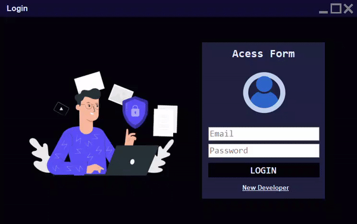

<h1 align="center">👨‍💻 Dev Allocation</h1>

    
    

 

    

A system for managing developer allocations  in projects

<h2>&#X1F4DD Project description</h2>

<h2>&#X1F528 Project functionalities</h2>

<ul>

</ul>

<h2>&#X1F4C1 Acess project</h2>

<h2>&#X2714 Used techniques and tecnologies</h2>
<ul>
    <li>
        Language C#
    </li>
    <li>    
        
        Visual Studio  
    </li>
        <li>    
        
        DBMS MySQL 
    </li>
    <li><bigger><b>OOP</b></bigger> Object Oriented  Programming</li>
</ul>
<ul><strong>Dependencies</strong>
    <li>
        <a href="https://learn.microsoft.com/en-us/ef/">Entity Framework</a>
    </li>
    <li>Mysql.Data</li>
    <li>Mysql.Data.EntityFramework</li>
<ul>

          
[)](https://www.linkedin.com/in/dkat-davi/)

